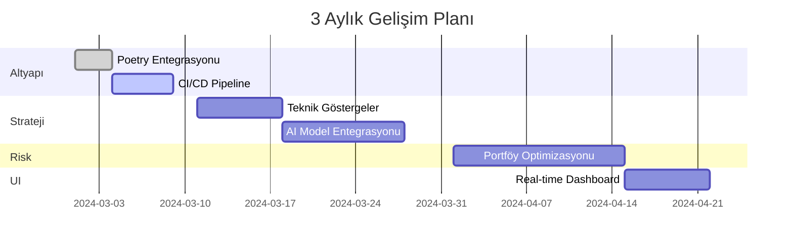

# Autonom ED v2.9.3 (Event-Driven Hotfix+)

Event-driven backtesting framework with:
- **Pure replay** backtest engine
- **Walk-forward** orchestrator
- **AI model registry** (RF, LogReg, XGBoost, LightGBM; CatBoost optional)
- **Risk**: volatility targeting + MaxDD guard
- **Reporting**: CAGR, Sharpe, Sortino, Calmar, MaxDD
- **Streamlit UI**: Data / Train / Run / Compare / Report
- **Mermaid Gantt** plan

## Quickstart

```bash
pip install -r requirements.txt     # or: poetry install
python -m autonom_ed.run_backtest   # single backtest
python -m autonom_ed.run_walkforward  # walk-forward
# or UI:
streamlit run autonom_ed/ui/streamlit_app.py
```

Outputs go to `out/`.

## Mermaid Gantt (3 Aylık Plan)



## Config
See `configs/main_config.yaml`.
